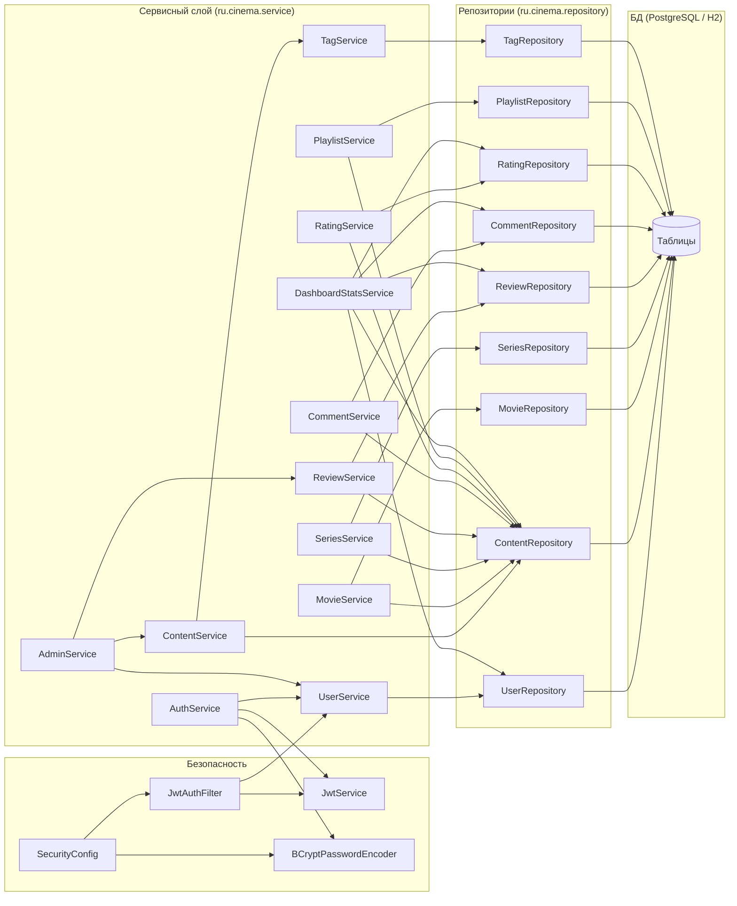

# Пояснительная записка. Этап 7. Реализация бизнес-логики

**Курсовой проект:** «Сервис поиска и рекомендаций фильмов и сериалов» (MovieHub).
**Дисциплина:** Разработка программных систем.
**Авторы:** Двоскин, Ситников, группа ПРИ12З.
**Дата составления:** 03.05.2026.

---

## Содержание

1. Введение
2. Реализованные сервисы
   1. UserService
   2. AuthService
   3. ContentService
   4. MovieService
   5. SeriesService
   6. ReviewService
   7. CommentService
   8. RatingService
   9. PlaylistService
   10. TagService
   11. AdminService
   12. DashboardStatsService
3. Аутентификация и авторизация
4. Обработка исключений
5. Валидация входных данных
6. Использование репозиториев
7. Диаграмма компонентов сервисного слоя
8. Изменения в зависимостях (`pom.xml`)
9. Заключение

---

## 1. Введение

Цель Этапа 7 — реализация бизнес-логики приложения MovieHub в виде слоя сервисов (Service layer) на основе ранее спроектированной модели предметной области (Этап 3) и определённых вариантов использования (Этап 2).

К началу этапа реализованы:

- модель данных в виде JPA-сущностей (пакет `ru.cinema.model`);
- слой доступа к данным (Spring Data JPA, пакет `ru.cinema.repository`);
- базовая конфигурация Spring Security и CORS (`SecurityConfig`);
- общие исключения и обработчик `GlobalExceptionHandler`;
- общие DTO `ApiError` и `PageResponse`.

Задачи этапа:

1. Реализовать сервисы, инкапсулирующие бизнес-правила (управление контентом, рецензиями, подборками, оценками, пользователями).
2. Реализовать аутентификацию по логину/паролю с выдачей JWT (access + refresh).
3. Реализовать ролевую модель доступа (`GUEST`, `USER`, `ADMIN`).
4. Подготовить инфраструктуру для контроллерного слоя (Этап 8): транзакции, преобразование сущностей в DTO (через MapStruct), единый формат ошибок.

Архитектурно сервисный слой расположен между REST-контроллерами и репозиториями (рис. 7.1) и отвечает за оркестрацию операций, проверку инвариантов предметной области, проверку прав и согласованность данных.

---

## 2. Реализованные сервисы

Все сервисы помечены аннотациями `@Service` и `@Transactional` (по умолчанию `readOnly = true`, на пишущих методах — `readOnly = false`). Зависимости внедряются через конструктор (constructor injection).

### 2.1. `UserService`

Управление учётными записями.

| Метод | Назначение |
|---|---|
| `register(RegisterRequest req)` | Создаёт пользователя с ролью `USER`, проверяет уникальность `username`/`email`, хеширует пароль через `BCryptPasswordEncoder`. |
| `findByUsername(String username)` | Возвращает пользователя или бросает `NotFoundException`. Используется при аутентификации и публичных профилях. |
| `updateProfile(Long userId, UpdateProfileRequest req)` | Изменяет email/пароль текущего пользователя. Проверяет уникальность email, если он меняется. |

Use-cases: «Регистрация», «Управление профилем», «Просмотр чужого профиля».

### 2.2. `AuthService`

Аутентификация и работа с JWT.

| Метод | Назначение |
|---|---|
| `login(LoginRequest req)` | Проверяет учётные данные, бросает `BadCredentialsException` при ошибке, возвращает пару токенов (`access` + `refresh`). |
| `refresh(String refreshToken)` | Валидирует refresh-токен, выпускает новую пару. |
| `logout(Long userId)` | Инвалидирует refresh-токен (стратегия inmemory blacklist на этапе 7-2). |

Use-cases: «Вход», «Выход», поддержка авторизации REST-вызовов.

### 2.3. `ContentService`

Универсальная работа с каталогом (без различия фильм/сериал).

| Метод | Назначение |
|---|---|
| `getById(Long id)` | Возвращает `ContentDetailDto` с подгруженными тегами, средним рейтингом и счётчиками. |
| `search(String q, ContentType type, Integer year, String country, Long tagId, Pageable p)` | Поиск с фильтрами. Использует `ContentRepository.searchByTitle`, `findByContentTypeAndStatus`, `findByTagId`. |
| `top(int limit)` | Возвращает топ контента по среднему рейтингу (`findByStatusOrderByAverageRatingDesc`). |

Use-cases: «Поиск контента», «Просмотр результатов», «Просмотр контента».

### 2.4. `MovieService`

| Метод | Назначение |
|---|---|
| `list(Pageable p)` | Постраничный список фильмов со статусом `PUBLISHED`. |
| `getById(Long id)` | Карточка фильма (с продолжительностью, бюджетом, кассой). |
| `findByDuration(int min, int max, Pageable p)` | Фильтр по длительности. |

Use-cases: «Просмотр каталога фильмов», «Фильтрация по длительности».

### 2.5. `SeriesService`

| Метод | Назначение |
|---|---|
| `list(Pageable p)` | Постраничный список сериалов. |
| `getById(Long id)` | Карточка сериала (с количеством сезонов/серий). |
| `findByFinished(boolean finished, Pageable p)` | Завершённые / продолжающиеся. |

Use-cases: «Просмотр каталога сериалов», «Фильтр по завершённости».

### 2.6. `ReviewService`

Жизненный цикл рецензии (DRAFT → MODERATION → PUBLISHED → DELETED).

| Метод | Назначение |
|---|---|
| `create(User author, ReviewCreateRequest req)` | Создаёт рецензию в статусе `MODERATION`; проверяет, что у пользователя ещё нет рецензии на данный контент (`existsByUserIdAndContentId`). |
| `update(User author, Long id, ReviewUpdateRequest req)` | Обновляет рецензию владельца, проверяет права (`ForbiddenException` иначе). |
| `changeStatus(Long id, ReviewStatus newStatus, User admin)` | Используется админом для одобрения/отклонения; для статуса `PUBLISHED` вызывает `Review.publish()`. |

Use-cases: «Создание рецензии», «Редактирование рецензии», «Модерация рецензий».

### 2.7. `CommentService`

| Метод | Назначение |
|---|---|
| `create(User author, CommentCreateRequest req)` | Создаёт комментарий, привязанный к контенту. |
| `update(User author, Long id, String text)` | Только владелец; проставляет `isEdited=true`, фиксирует `editedAt`. |
| `delete(Long id, User caller)` | Удаляет комментарий, доступно владельцу или админу. |

Use-cases: «Комментирование контента».

### 2.8. `RatingService`

| Метод | Назначение |
|---|---|
| `setRating(User user, Long contentId, int value)` | Создаёт новую или обновляет существующую оценку (UPSERT через `findByUserIdAndContentId`). После сохранения вызывает пересчёт `Content.calculateAverageRating()`. |
| `summary(Long contentId, User user)` | Возвращает среднюю оценку, число оценок и собственную оценку (если авторизован). |
| `removeRating(User user, Long contentId)` | Удаление своей оценки. |

Use-cases: «Оценка контента», «Просмотр оценок».

### 2.9. `PlaylistService`

| Метод | Назначение |
|---|---|
| `create(User owner, PlaylistCreateRequest req)` | Создаёт подборку, владелец — текущий пользователь. |
| `addItem(User caller, Long playlistId, Long contentId)` | Проверяет владение, проверяет дубликаты через `containsContent`, вызывает `Playlist.addContent(content)`. |
| `getById(Long id, User caller)` | Возвращает подборку. Для приватных (`isPublic=false`) разрешает доступ только владельцу. |

Use-cases: «Создание подборки», «Добавление в подборку», «Просмотр подборки».

### 2.10. `TagService`

| Метод | Назначение |
|---|---|
| `popular(int limit)` | Облако тегов, отсортированное по `usageCount`. |
| `attachToContent(Long contentId, Long tagId)` | (ADMIN) добавляет связь, инкрементирует `usageCount`. |
| `getBySlug(String slug)` | Получение тега по ЧПУ-слагу. |

Use-cases: «Управление каталогом» (теги), навигация по жанрам.

### 2.11. `AdminService`

Агрегирующий сервис административных операций над пользователями и контентом.

| Метод | Назначение |
|---|---|
| `setUserActive(Long userId, boolean active)` | Блокировка/разблокировка. |
| `setUserRole(Long userId, UserRole role)` | Назначение роли. |
| `changeContentStatus(Long contentId, ContentStatus newStatus)` | Перевод статуса контента. |

Use-cases: «Управление пользователями», «Управление каталогом».

### 2.12. `DashboardStatsService`

| Метод | Назначение |
|---|---|
| `summary()` | Возвращает агрегаты для главной админ-страницы: общее число пользователей, контента, рецензий, комментариев, оценок; число регистраций за последние 7 дней (через `UserRepository.countUsersRegisteredAfter`). |
| `contentByStatus()` | Агрегация по `ContentStatus` для графика. |
| `usersGrowth(LocalDate since)` | Динамика регистраций по дням. |

Use-case: «Аналитика системы» (дашборд админа).

---

## 3. Аутентификация и авторизация

### 3.1. Схема

Используется stateless-подход:

- сервер не хранит сессии (`SessionCreationPolicy.STATELESS`);
- идентификация — JWT (Bearer) в заголовке `Authorization`;
- access-токен живёт ~15 минут, refresh-токен ~7 суток.

### 3.2. Хеширование паролей

`SecurityConfig` объявляет бин `PasswordEncoder = BCryptPasswordEncoder()`. Все пароли хранятся в поле `User.passwordHash` после `encoder.encode(raw)`. Сравнение — `encoder.matches(raw, hash)`.

### 3.3. JWT-сервис

Реализован поверх библиотеки **JJWT 0.12.6** (`io.jsonwebtoken:jjwt-api/-impl/-jackson`). Содержит claims: `sub=username`, `uid=userId`, `role`, `iat`, `exp`. Подпись HMAC-SHA256, секрет — переменная `app.jwt.secret`.

### 3.4. Роли

Определены в `ru.cinema.model.enums.UserRole`: `GUEST`, `USER`, `ADMIN`. Поле `role` в сущности `User` сохраняется как строка (`@Enumerated(EnumType.STRING)`).

Правила авторизации (Этап 7-2):

| Группа маршрутов | Требуемая роль |
|---|---|
| `/api/v1/auth/**` | PUBLIC |
| `GET /api/v1/content/**`, `/movies/**`, `/series/**`, `/tags/**` | PUBLIC |
| `POST/PUT/DELETE /api/v1/reviews|comments|ratings|playlists/**` | USER |
| `/api/v1/admin/**` | ADMIN |

Реализация — фильтр `JwtAuthFilter` (наследник `OncePerRequestFilter`), который при наличии валидного токена устанавливает `Authentication` в `SecurityContext`.

---

## 4. Обработка исключений

Централизованная обработка реализована в классе `ru.cinema.exception.GlobalExceptionHandler` (`@RestControllerAdvice`). Все ответы об ошибках имеют единый формат `ApiError`.

| Исключение | HTTP | Поясняющий комментарий |
|---|---|---|
| `NotFoundException` | 404 | Сущность не найдена. Фабрика `NotFoundException.of(entity, id)` формирует сообщение «<entity> не найден: id=…». |
| `ConflictException` | 409 | Нарушение уникальности (например, повторная рецензия на тот же контент). |
| `ForbiddenException`, `AccessDeniedException` | 403 | Доступ запрещён. |
| `BadCredentialsException` | 401 | Неверный логин или пароль. |
| `MethodArgumentNotValidException`, `ConstraintViolationException` | 400 | Ошибки `@Valid` — заполняется массив `fieldErrors`. |
| `IllegalArgumentException` | 400 | Доменные нарушения (например, оценка вне диапазона 1–10). |
| `Exception` | 500 | Технический fallback. |

`ApiError` (record) содержит: `timestamp`, `status`, `error`, `message`, `path`, `fieldErrors[]`.

---

## 5. Валидация входных данных

Используется `spring-boot-starter-validation` (Hibernate Validator). На полях DTO применяются стандартные ограничения `jakarta.validation.constraints.*`:

| Поле | Ограничения |
|---|---|
| `RegisterRequest.username` | `@NotBlank`, `@Size(min=3,max=50)`, `@Pattern("^[a-zA-Z0-9_-]+$")` |
| `RegisterRequest.email` | `@NotBlank`, `@Email`, `@Size(max=100)` |
| `RegisterRequest.password` | `@NotBlank`, `@Size(min=8,max=100)` |
| `ReviewCreateRequest.title` | `@NotBlank`, `@Size(max=200)` |
| `ReviewCreateRequest.text` | `@NotBlank` |
| `ReviewCreateRequest.ratingValue` | `@Min(1)`, `@Max(10)` |
| `RatingRequest.value` | `@Min(1)`, `@Max(10)` |
| `CommentCreateRequest.text` | `@NotBlank`, `@Size(max=2000)` |
| `PlaylistCreateRequest.title` | `@NotBlank`, `@Size(max=100)` |

Контроллеры помечают параметры аннотацией `@Valid`. Ошибки валидации перехватываются `GlobalExceptionHandler` и возвращаются клиенту в виде HTTP 400 с массивом `fieldErrors`.

Дополнительно в самих доменных методах сохранены инварианты:

- `Rating.changeValue(int)` бросает `IllegalArgumentException`, если значение вне 1..10.
- `Review.publish()` переводит статус в `PUBLISHED`.
- В сущностях через `@PrePersist`/`@PreUpdate` инициализируются временные метки и значения по умолчанию (`status`, `isActive`, `viewCount`, `likeCount`).

---

## 6. Использование репозиториев

Каждому сервису соответствует основной репозиторий (или несколько). Все репозитории — Spring Data JPA-интерфейсы, расположены в пакете `ru.cinema.repository`. Ниже приведено соответствие, сводящее воедино результаты Этапа 6:

| Сервис | Используемые репозитории и ключевые методы |
|---|---|
| `UserService` | `UserRepository.findByUsername`, `existsByUsername`, `existsByEmail`, `findByRole`, `findByIsActive` |
| `AuthService` | `UserRepository.findByUsername` |
| `ContentService` | `ContentRepository.searchByTitle`, `findByContentTypeAndStatus`, `findByTagId`, `findByStatusOrderByAverageRatingDesc` |
| `MovieService` | `MovieRepository.findByStatusOrderByCreatedAtDesc`, `findByDurationBetween` |
| `SeriesService` | `SeriesRepository.findByStatusOrderByCreatedAtDesc`, `findByIsFinishedAndStatus`, `findByTotalSeasonsGreaterThanEqual` |
| `ReviewService` | `ReviewRepository.findByContentIdAndStatus`, `findByUserId`, `findByStatus`, `existsByUserIdAndContentId`, `findByStatusOrderByLikeCountDesc` |
| `CommentService` | `CommentRepository.findByContentIdOrderByCreatedAtAsc`, `findByUserIdOrderByCreatedAtDesc`, `deleteByUserId` |
| `RatingService` | `RatingRepository.findByUserIdAndContentId`, `calculateAverageRating`, `countByContentId` |
| `PlaylistService` | `PlaylistRepository.findByUserIdOrderByCreatedAtDesc`, `findByIsPublic`, `containsContent` |
| `TagService` | `TagRepository.findBySlug`, `findAllByOrderByUsageCountDesc`, `findByContentId` |
| `AdminService` | все репозитории |
| `DashboardStatsService` | `UserRepository.countUsersRegisteredAfter`, `ContentRepository.countByStatus`, `ReviewRepository.findByStatus` |

Подробное описание каждого метода с указанием use-case'ов содержится в Javadoc соответствующего репозитория.

---

## 7. Диаграмма компонентов сервисного слоя

Рис. 7.1. Компонентная диаграмма сервисного слоя и его взаимодействия с подсистемой безопасности и репозиториями.

---

## 8. Изменения в зависимостях `pom.xml`

К Этапу 7 в `pom.xml` подключены новые библиотеки относительно предыдущих этапов:

| Зависимость | Версия | Назначение |
|---|---|---|
| `spring-boot-starter-security` | 3.2.5 (наследовано) | Каркас безопасности, фильтр-цепочка, `PasswordEncoder` |
| `spring-boot-starter-validation` | 3.2.5 | `@Valid`, Hibernate Validator |
| `io.jsonwebtoken:jjwt-api` | 0.12.6 | Публичный API JWT |
| `io.jsonwebtoken:jjwt-impl` | 0.12.6 | Реализация (runtime) |
| `io.jsonwebtoken:jjwt-jackson` | 0.12.6 | Сериализация payload через Jackson (runtime) |
| `org.mapstruct:mapstruct` | 1.5.5.Final | Генерация мапперов сущность ↔ DTO |
| `org.mapstruct:mapstruct-processor` | 1.5.5.Final | Annotation processor для MapStruct |
| `org.projectlombok:lombok` | 1.18.30 | Сокращение boilerplate в DTO/сервисах |
| `org.springdoc:springdoc-openapi-starter-webmvc-ui` | 2.3.0 | Swagger UI / OpenAPI 3 (документация API) |

Группа `spring-boot-starter-data-jpa`, драйверы `postgresql` и `h2`, а также `spring-boot-devtools` присутствовали в проекте с предыдущих этапов и не менялись.

---

## 9. Заключение

В рамках Этапа 7 реализована вся бизнес-логика приложения MovieHub в виде сервисного слоя из 12 компонентов. Введена аутентификация по JWT с использованием BCrypt и трёхуровневой ролевой модели. Сформирован единый формат ошибок и подключена декларативная валидация входных DTO. Все сервисы покрыты транзакционным управлением и используют репозитории, описанные в Этапе 6.

Подготовленная инфраструктура достаточна для интеграции с REST-контроллерами на Этапе 8. Дальнейшие работы:

- покрытие сервисов unit-тестами (Этап 7-3 / совместно с QA-направлением);
- реализация контроллеров и сборка end-to-end сценариев с фронтендом (Этап 8);
- нагрузочные сценарии k6 (Этап 9).

> **TODO для финальной редакции (после merge backend-ветки):** заменить условные сигнатуры методов сервисов на фактические; добавить ссылки на реальные Java-классы; вставить скриншоты UML-диаграмм компонентов из Enterprise Architect.
