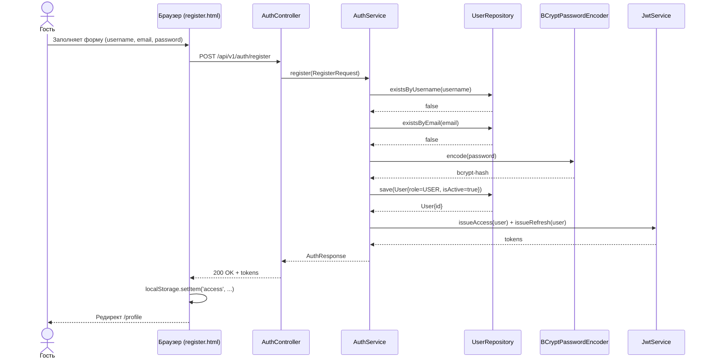
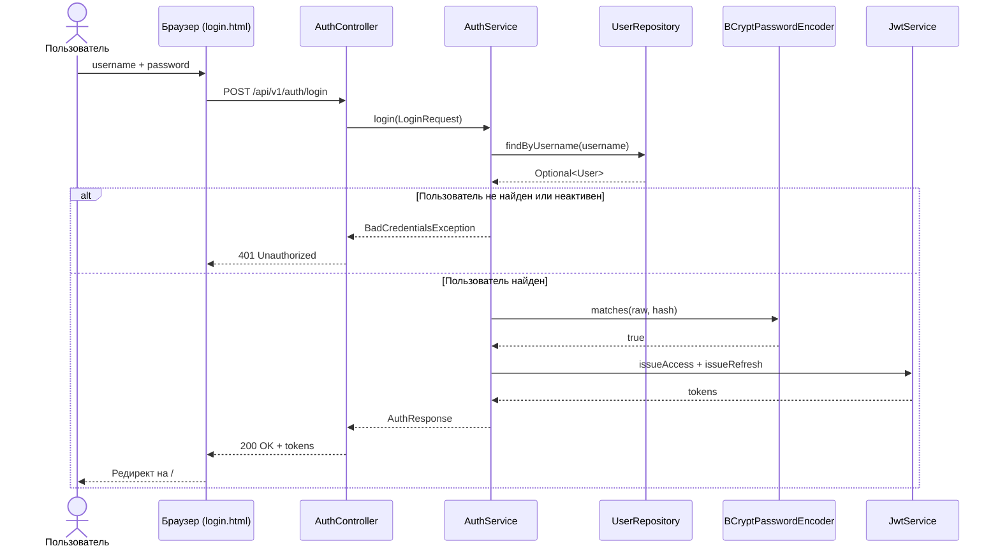
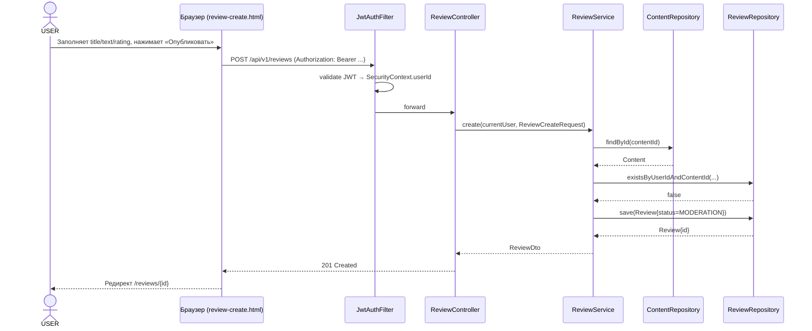
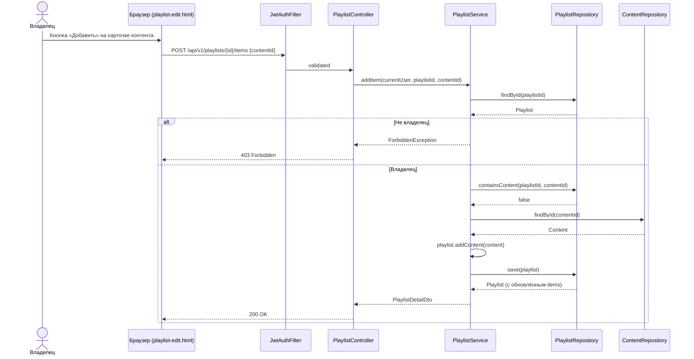
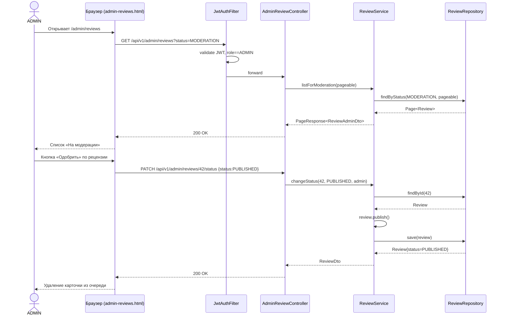

# API map — MovieHub

Этап 8. Карта маршрутизации, REST API и пользовательских сценариев.

> **Статус документа:** проектная редакция от 03.05.2026.
> Source of truth для view-маршрутов — `cinema-service/src/main/java/ru/cinema/config/WebConfig.java`.
> Source of truth для REST — пакет `ru.cinema.controller` (на момент составления документа сервисный и контроллерный слои находятся в активной разработке; финальная сверка после merge backend-ветки).

---

## Содержание

1. Общие соглашения
2. Pretty URLs (view-маршруты)
3. REST API endpoints
   1. Аутентификация и аккаунт
   2. Контент: фильмы, сериалы, общий каталог
   3. Рецензии
   4. Комментарии
   5. Оценки
   6. Подборки
   7. Теги
   8. Профиль и публичные пользователи
   9. Администрирование
   10. Дашборд и статистика
4. Перекрёстная ссылка use-case → endpoints
5. Mermaid sequence диаграммы

---

## 1. Общие соглашения

| Параметр | Значение |
|---|---|
| База REST API | `/api/v1` |
| Формат | `application/json; charset=UTF-8` |
| Аутентификация | Bearer JWT в заголовке `Authorization: Bearer <access>` |
| Пагинация | query-параметры `page` (с 0), `size` (по умолчанию 20), `sort` (`field,DIR`) |
| Формат ошибок | `ApiError { timestamp, status, error, message, path, fieldErrors[] }` |
| Формат страниц | `PageResponse { items[], page, size, totalElements, totalPages, hasNext, hasPrev }` |

**Уровни авторизации:**

- `PUBLIC` — без токена (гость).
- `USER` — требуется валидный JWT с ролью `USER` или `ADMIN`.
- `OWNER` — требуется JWT, ресурс должен принадлежать вызывающему пользователю (или вызывающий — `ADMIN`).
- `ADMIN` — требуется JWT с ролью `ADMIN`.

---

## 2. Pretty URLs (view-маршруты)

Источник: `WebConfig.addViewControllers(...)`. Spring MVC форвардит запрос на статический HTML-файл из `src/main/resources/static`. Динамические данные подгружаются на стороне браузера через `fetch` к `/api/v1/*`.

| URL | HTTP | Файл | Назначение |
|---|---|---|---|
| `/` | GET | `index.html` | Главная: подборка популярного контента |
| `/movies` | GET | `movies.html` | Каталог фильмов |
| `/series` | GET | `series.html` | Каталог сериалов |
| `/search` | GET | `search.html` | Поиск с фильтрами |
| `/movies/{id:\d+}` | GET | `content-detail.html` | Карточка фильма |
| `/series/{id:\d+}` | GET | `content-detail.html` | Карточка сериала |
| `/content/{id:\d+}` | GET | `content-detail.html` | Универсальная карточка контента |
| `/login` | GET | `login.html` | Форма входа |
| `/register` | GET | `register.html` | Форма регистрации |
| `/profile` | GET | `profile.html` | Личный кабинет текущего пользователя |
| `/users/{username}` | GET | `user-profile.html` | Публичный профиль другого пользователя |
| `/me/reviews` | GET | `my-reviews.html` | «Мои рецензии» |
| `/me/playlists` | GET | `my-playlists.html` | «Мои подборки» |
| `/reviews/new` | GET | `review-create.html` | Создание рецензии |
| `/reviews/{id:\d+}` | GET | `review-detail.html` | Просмотр рецензии |
| `/reviews/{id:\d+}/edit` | GET | `review-edit.html` | Редактирование рецензии |
| `/playlists/new` | GET | `playlist-create.html` | Создание подборки |
| `/playlists/{id:\d+}` | GET | `playlist-detail.html` | Просмотр подборки |
| `/playlists/{id:\d+}/edit` | GET | `playlist-edit.html` | Редактирование подборки |
| `/admin` | GET | `admin.html` | Дашборд администратора |
| `/admin/content` | GET | `admin-content.html` | Управление каталогом |
| `/admin/users` | GET | `admin-users.html` | Управление пользователями |
| `/admin/reviews` | GET | `admin-reviews.html` | Модерация рецензий |

**Принцип:** пользователь и поисковые роботы видят «человеческие» URL (`/movies/123`), фактическая отдача — статический файл `content-detail.html`, который при загрузке через JS извлекает `id` из `window.location.pathname` и делает запрос `GET /api/v1/content/123`.

---

## 3. REST API endpoints

### 3.1. Аутентификация и аккаунт (`/api/v1/auth`)

| Метод | URL | Auth | Request DTO | Response DTO | Use-case |
|---|---|---|---|---|---|
| POST | `/api/v1/auth/register` | PUBLIC | `RegisterRequest { username, email, password }` | `AuthResponse { accessToken, refreshToken, user: UserDto }` | Регистрация нового пользователя |
| POST | `/api/v1/auth/login` | PUBLIC | `LoginRequest { username, password }` | `AuthResponse` | Вход в систему |
| POST | `/api/v1/auth/refresh` | PUBLIC | `RefreshRequest { refreshToken }` | `AuthResponse` | Обновление access-токена |
| POST | `/api/v1/auth/logout` | USER | — | `204 No Content` | Выход (инвалидация refresh) |
| GET | `/api/v1/auth/me` | USER | — | `UserDto` | Получить данные текущего пользователя |

### 3.2. Контент

#### 3.2.1. Универсальные операции (`/api/v1/content`)

| Метод | URL | Auth | Request | Response | Use-case |
|---|---|---|---|---|---|
| GET | `/api/v1/content` | PUBLIC | query: `page, size, sort, status` | `PageResponse<ContentDto>` | Просмотр всего опубликованного каталога |
| GET | `/api/v1/content/{id}` | PUBLIC | — | `ContentDetailDto` (включает теги, средний рейтинг, счётчики) | Просмотр карточки контента |
| GET | `/api/v1/content/search` | PUBLIC | query: `q, page, size, type, year, country, tag` | `PageResponse<ContentDto>` | Поиск по названию + фильтры |
| GET | `/api/v1/content/top` | PUBLIC | query: `limit` | `List<ContentDto>` | Топ по среднему рейтингу |
| GET | `/api/v1/content/{id}/comments` | PUBLIC | query: `page, size` | `PageResponse<CommentDto>` | Комментарии к контенту |
| GET | `/api/v1/content/{id}/reviews` | PUBLIC | query: `page, size` | `PageResponse<ReviewDto>` | Рецензии к контенту (только PUBLISHED) |
| GET | `/api/v1/content/{id}/tags` | PUBLIC | — | `List<TagDto>` | Теги, привязанные к контенту |
| GET | `/api/v1/content/{id}/rating` | PUBLIC | — | `RatingSummaryDto { average, count, userRating? }` | Средняя оценка + (если авторизован) собственная |
| POST | `/api/v1/content/{id}/rating` | USER | `RatingRequest { value }` | `RatingDto` | Поставить или изменить оценку (1–10) |
| DELETE | `/api/v1/content/{id}/rating` | USER | — | `204` | Удалить свою оценку |

#### 3.2.2. Фильмы (`/api/v1/movies`)

| Метод | URL | Auth | Request | Response | Use-case |
|---|---|---|---|---|---|
| GET | `/api/v1/movies` | PUBLIC | query: `page, size, sort` | `PageResponse<MovieDto>` | Каталог фильмов |
| GET | `/api/v1/movies/{id}` | PUBLIC | — | `MovieDetailDto` | Карточка фильма (с duration/budget/boxOffice) |
| GET | `/api/v1/movies/by-duration` | PUBLIC | query: `min, max, page, size` | `PageResponse<MovieDto>` | Фильтр по длительности |

#### 3.2.3. Сериалы (`/api/v1/series`)

| Метод | URL | Auth | Request | Response | Use-case |
|---|---|---|---|---|---|
| GET | `/api/v1/series` | PUBLIC | query: `page, size, sort` | `PageResponse<SeriesDto>` | Каталог сериалов |
| GET | `/api/v1/series/{id}` | PUBLIC | — | `SeriesDetailDto` | Карточка сериала |
| GET | `/api/v1/series/by-status` | PUBLIC | query: `finished=true|false` | `PageResponse<SeriesDto>` | Завершённые / продолжающиеся |

### 3.3. Рецензии (`/api/v1/reviews`)

| Метод | URL | Auth | Request | Response | Use-case |
|---|---|---|---|---|---|
| GET | `/api/v1/reviews` | PUBLIC | query: `page, size, sort=likes|date` | `PageResponse<ReviewDto>` | Список опубликованных рецензий |
| GET | `/api/v1/reviews/{id}` | PUBLIC | — | `ReviewDetailDto` | Просмотр одной рецензии (увеличивает viewCount) |
| POST | `/api/v1/reviews` | USER | `ReviewCreateRequest { contentId, title, text, ratingValue }` | `ReviewDto` (статус MODERATION или DRAFT) | Создание рецензии |
| PUT | `/api/v1/reviews/{id}` | OWNER | `ReviewUpdateRequest { title, text, ratingValue }` | `ReviewDto` | Редактирование своей рецензии |
| DELETE | `/api/v1/reviews/{id}` | OWNER | — | `204` | Удаление своей рецензии |
| POST | `/api/v1/reviews/{id}/like` | USER | — | `ReviewDto` (новый likeCount) | Лайк рецензии |
| DELETE | `/api/v1/reviews/{id}/like` | USER | — | `ReviewDto` | Снять лайк |

### 3.4. Комментарии (`/api/v1/comments`)

| Метод | URL | Auth | Request | Response | Use-case |
|---|---|---|---|---|---|
| POST | `/api/v1/comments` | USER | `CommentCreateRequest { contentId, text }` | `CommentDto` | Оставить комментарий |
| PUT | `/api/v1/comments/{id}` | OWNER | `CommentUpdateRequest { text }` | `CommentDto` (`isEdited=true`) | Редактирование |
| DELETE | `/api/v1/comments/{id}` | OWNER, ADMIN | — | `204` | Удаление |

### 3.5. Подборки (`/api/v1/playlists`)

| Метод | URL | Auth | Request | Response | Use-case |
|---|---|---|---|---|---|
| GET | `/api/v1/playlists` | PUBLIC | query: `page, size, q` | `PageResponse<PlaylistDto>` | Публичные подборки + поиск |
| GET | `/api/v1/playlists/{id}` | PUBLIC* | — | `PlaylistDetailDto { ..., items[] }` | Просмотр подборки (приватные — только владельцу) |
| POST | `/api/v1/playlists` | USER | `PlaylistCreateRequest { title, description, coverImageUrl, isPublic }` | `PlaylistDto` | Создание |
| PUT | `/api/v1/playlists/{id}` | OWNER | `PlaylistUpdateRequest` | `PlaylistDto` | Редактирование |
| DELETE | `/api/v1/playlists/{id}` | OWNER | — | `204` | Удаление |
| POST | `/api/v1/playlists/{id}/items` | OWNER | `AddItemRequest { contentId }` | `PlaylistDetailDto` | Добавить контент в подборку |
| DELETE | `/api/v1/playlists/{id}/items/{contentId}` | OWNER | — | `204` | Убрать контент из подборки |

### 3.6. Теги (`/api/v1/tags`)

| Метод | URL | Auth | Request | Response | Use-case |
|---|---|---|---|---|---|
| GET | `/api/v1/tags` | PUBLIC | query: `q?` | `List<TagDto>` | Список тегов / автодополнение |
| GET | `/api/v1/tags/popular` | PUBLIC | query: `limit` | `List<TagDto>` | Облако тегов |
| GET | `/api/v1/tags/{slug}` | PUBLIC | — | `TagDto` | Тег по слагу |
| GET | `/api/v1/tags/{id}/content` | PUBLIC | query: `page, size` | `PageResponse<ContentDto>` | Контент по тегу |

### 3.7. Профиль и публичные пользователи (`/api/v1/users`)

| Метод | URL | Auth | Request | Response | Use-case |
|---|---|---|---|---|---|
| GET | `/api/v1/users/me` | USER | — | `UserProfileDto` | Личный кабинет |
| PUT | `/api/v1/users/me` | USER | `UpdateProfileRequest { email?, password? }` | `UserProfileDto` | Изменение своих данных |
| GET | `/api/v1/users/me/reviews` | USER | query: `page, size` | `PageResponse<ReviewDto>` | Мои рецензии |
| GET | `/api/v1/users/me/playlists` | USER | — | `List<PlaylistDto>` | Мои подборки |
| GET | `/api/v1/users/me/ratings` | USER | — | `List<RatingDto>` | Мои оценки |
| GET | `/api/v1/users/{username}` | PUBLIC | — | `PublicUserDto` | Публичный профиль |
| GET | `/api/v1/users/{username}/reviews` | PUBLIC | query: `page, size` | `PageResponse<ReviewDto>` | Публичные рецензии пользователя |
| GET | `/api/v1/users/{username}/playlists` | PUBLIC | — | `List<PlaylistDto>` | Публичные подборки пользователя |

### 3.8. Администрирование (`/api/v1/admin`)

| Метод | URL | Auth | Request | Response | Use-case |
|---|---|---|---|---|---|
| GET | `/api/v1/admin/users` | ADMIN | query: `page, size, role?, isActive?` | `PageResponse<UserAdminDto>` | Управление пользователями |
| PATCH | `/api/v1/admin/users/{id}/status` | ADMIN | `{ isActive: boolean }` | `UserAdminDto` | Блокировка / разблокировка |
| PATCH | `/api/v1/admin/users/{id}/role` | ADMIN | `{ role: USER\|ADMIN }` | `UserAdminDto` | Назначение роли |
| GET | `/api/v1/admin/content` | ADMIN | query: `status?, type?` | `PageResponse<ContentAdminDto>` | Управление каталогом |
| POST | `/api/v1/admin/content/movies` | ADMIN | `MovieCreateRequest` | `MovieDto` | Добавить фильм |
| POST | `/api/v1/admin/content/series` | ADMIN | `SeriesCreateRequest` | `SeriesDto` | Добавить сериал |
| PUT | `/api/v1/admin/content/{id}` | ADMIN | `ContentUpdateRequest` | `ContentDto` | Редактирование контента |
| PATCH | `/api/v1/admin/content/{id}/status` | ADMIN | `{ status: ContentStatus }` | `ContentDto` | Перевести статус (PUBLISHED, HIDDEN, REJECTED…) |
| DELETE | `/api/v1/admin/content/{id}` | ADMIN | — | `204` | Удалить контент |
| GET | `/api/v1/admin/reviews` | ADMIN | query: `status=MODERATION` | `PageResponse<ReviewAdminDto>` | Очередь модерации |
| PATCH | `/api/v1/admin/reviews/{id}/status` | ADMIN | `{ status: PUBLISHED\|DELETED }` | `ReviewDto` | Одобрить / отклонить рецензию |
| POST | `/api/v1/admin/tags` | ADMIN | `TagCreateRequest { name, slug, description? }` | `TagDto` | Создать тег |
| DELETE | `/api/v1/admin/tags/{id}` | ADMIN | — | `204` | Удалить тег |
| POST | `/api/v1/admin/content/{id}/tags/{tagId}` | ADMIN | — | `ContentDto` | Привязать тег к контенту |
| DELETE | `/api/v1/admin/content/{id}/tags/{tagId}` | ADMIN | — | `ContentDto` | Открепить тег |

### 3.9. Дашборд и статистика (`/api/v1/admin/stats`)

| Метод | URL | Auth | Request | Response | Use-case |
|---|---|---|---|---|---|
| GET | `/api/v1/admin/stats/summary` | ADMIN | — | `DashboardSummaryDto { usersTotal, contentTotal, reviewsTotal, commentsTotal, ratingsTotal, newUsers7d }` | Сводка дашборда |
| GET | `/api/v1/admin/stats/content-by-status` | ADMIN | — | `Map<ContentStatus, Long>` | График по статусам контента |
| GET | `/api/v1/admin/stats/users-growth` | ADMIN | query: `since=YYYY-MM-DD` | `List<{date, count}>` | Динамика регистраций |

> **TODO после merge backend-ветки:** свериться с фактическими аннотациями `@RequestMapping` контроллеров, актуализировать имена DTO согласно `ru.cinema.dto.*`, добавить колонку «реализовано» (✓/—).

---

## 4. Перекрёстная ссылка use-case → endpoints

| Use-case (из РПС, Этап 2) | View URL | REST endpoints, обслуживающие сценарий |
|---|---|---|
| **Регистрация** | `/register` | `POST /api/v1/auth/register` |
| **Вход / Выход** | `/login` | `POST /api/v1/auth/login`; `POST /api/v1/auth/logout`; `POST /api/v1/auth/refresh` |
| **Просмотр главной** | `/` | `GET /api/v1/content/top`; `GET /api/v1/tags/popular` |
| **Просмотр каталога фильмов** | `/movies` | `GET /api/v1/movies` |
| **Просмотр каталога сериалов** | `/series` | `GET /api/v1/series` |
| **Поиск контента** | `/search` | `GET /api/v1/content/search`; `GET /api/v1/tags` |
| **Просмотр карточки фильма** | `/movies/{id}` | `GET /api/v1/movies/{id}`; `GET /api/v1/content/{id}/comments`; `GET /api/v1/content/{id}/reviews`; `GET /api/v1/content/{id}/rating` |
| **Просмотр карточки сериала** | `/series/{id}` | `GET /api/v1/series/{id}` + те же коммент/рец/рейтинг endpoints |
| **Оценка контента** | (на карточке) | `POST /api/v1/content/{id}/rating`; `DELETE /api/v1/content/{id}/rating` |
| **Комментирование контента** | (на карточке) | `POST /api/v1/comments`; `PUT /api/v1/comments/{id}`; `DELETE /api/v1/comments/{id}` |
| **Создание рецензии** | `/reviews/new` | `POST /api/v1/reviews` |
| **Просмотр рецензии** | `/reviews/{id}` | `GET /api/v1/reviews/{id}`; `POST /api/v1/reviews/{id}/like` |
| **Редактирование рецензии** | `/reviews/{id}/edit` | `PUT /api/v1/reviews/{id}`; `DELETE /api/v1/reviews/{id}` |
| **Мои рецензии** | `/me/reviews` | `GET /api/v1/users/me/reviews` |
| **Создание подборки** | `/playlists/new` | `POST /api/v1/playlists` |
| **Просмотр подборки** | `/playlists/{id}` | `GET /api/v1/playlists/{id}` |
| **Добавление в подборку** | `/playlists/{id}/edit` | `POST /api/v1/playlists/{id}/items`; `DELETE /api/v1/playlists/{id}/items/{contentId}` |
| **Мои подборки** | `/me/playlists` | `GET /api/v1/users/me/playlists` |
| **Просмотр своего профиля** | `/profile` | `GET /api/v1/users/me`; `PUT /api/v1/users/me` |
| **Просмотр чужого профиля** | `/users/{username}` | `GET /api/v1/users/{username}`; `GET /api/v1/users/{username}/reviews`; `GET /api/v1/users/{username}/playlists` |
| **Дашборд админа** | `/admin` | `GET /api/v1/admin/stats/summary` + графики |
| **Управление контентом** | `/admin/content` | `GET /api/v1/admin/content`; `POST /api/v1/admin/content/movies`; `POST /api/v1/admin/content/series`; `PUT /api/v1/admin/content/{id}`; `PATCH /api/v1/admin/content/{id}/status`; `DELETE /api/v1/admin/content/{id}` |
| **Управление пользователями** | `/admin/users` | `GET /api/v1/admin/users`; `PATCH /api/v1/admin/users/{id}/status`; `PATCH /api/v1/admin/users/{id}/role` |
| **Модерация рецензий** | `/admin/reviews` | `GET /api/v1/admin/reviews?status=MODERATION`; `PATCH /api/v1/admin/reviews/{id}/status` |
| **Управление тегами** | `/admin/content` | `POST /api/v1/admin/tags`; `DELETE /api/v1/admin/tags/{id}`; `POST /api/v1/admin/content/{id}/tags/{tagId}` |

---

## 5. Mermaid sequence диаграммы

### 5.1. Регистрация

### 5.2. Вход

### 5.3. Создание рецензии

### 5.4. Добавление контента в подборку

### 5.5. Модерация рецензии админом

---

## Приложения

- **A.** Перечисления см. `ru.cinema.model.enums.*` (`UserRole`, `ContentStatus`, `ReviewStatus`, `ContentType`).
- **B.** Формат ошибок: `ru.cinema.dto.common.ApiError`, обработчик — `GlobalExceptionHandler`.
- **C.** Swagger UI документация развёртывается по адресу `/swagger-ui/index.html` (springdoc-openapi-starter-webmvc-ui 2.3.0).
