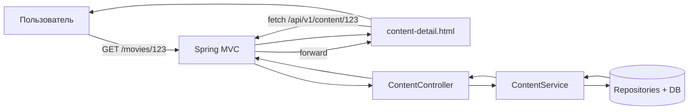
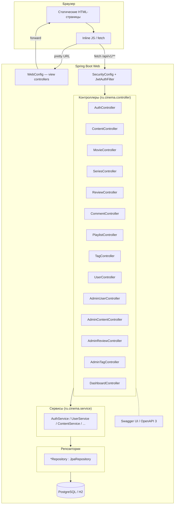

# Пояснительная записка. Этап 8. Контроллеры и интеграция с фронтендом

**Курсовой проект:** «Сервис поиска и рекомендаций фильмов и сериалов» (MovieHub).
**Дисциплина:** Разработка программных систем.
**Авторы:** Двоскин, Ситников, группа ПРИ12З.
**Дата составления:** 03.05.2026.

---

## Содержание

1. Введение
2. Архитектурное решение
3. REST-контроллеры
4. Pretty URL и форвардинг через `WebConfig`
5. Безопасность: правила доступа и JWT-фильтр
6. Интеграция с фронтендом
7. Документация API: Swagger UI
8. Компонентная диаграмма
9. Описание ключевых страниц
10. Заключение

---

## 1. Введение

Цель Этапа 8 — реализовать REST-API над сервисным слоем (Этап 7) и интегрировать его с набором HTML-страниц, разработанных в Этапе 4 (21 страница). Совокупно решение должно представлять собой работающее веб-приложение, доступное по «человеческим» URL и использующее JWT-аутентификацию.

Решаемые задачи:

1. Спроектировать структуру REST-API и реализовать контроллеры под сервисный слой.
2. Обеспечить «pretty URL»-маршрутизацию для просмотра HTML-страниц.
3. Сконфигурировать `SecurityConfig` под рабочие правила доступа и подключить `JwtAuthFilter`.
4. Подключить документацию API (Swagger UI / OpenAPI 3).
5. Заменить mock-данные на стороне фронтенда вызовами `fetch` к реальному API.

Полная карта endpoints, view-маршрутов и use-case'ов вынесена в отдельный документ — `Этап 8/API_map.md`.

---

## 2. Архитектурное решение

Применена двухслойная компоновка:

- **Server-side**: Spring Boot 3.2.5; контроллеры обслуживают два рода запросов:
  - REST (`/api/v1/**`) — JSON-ответы;
  - View-маршруты (без префикса `/api/v1`) — форвардятся на статические HTML-файлы из `src/main/resources/static`.
- **Client-side**: статические HTML/CSS/JS-страницы. После загрузки страницы встроенный JS извлекает идентификаторы из `window.location.pathname` и выполняет `fetch`-запросы к `/api/v1/**` для подгрузки данных. Авторизованные запросы добавляют заголовок `Authorization: Bearer <token>`, токены хранятся в `localStorage`.

Такой подход:

- сохраняет ЧПУ-схему (`/movies/123` вместо `/static/content-detail.html?id=123`);
- не требует серверного шаблонизатора (Thymeleaf/JSP), упрощает деплой;
- позволяет фронтенду быть полностью независимым (потенциально вынесен в SPA при дальнейшем развитии).

Базовая схема обмена данными — рис. 8.1.



Рис. 8.1. Общая схема: «pretty URL → HTML → fetch → REST → сервис → БД».

---

## 3. REST-контроллеры

Контроллеры расположены в пакете `ru.cinema.controller` и помечены аннотацией `@RestController`. Базовый префикс `/api/v1`. Состав:

| Контроллер | Базовый путь | Сервис | Назначение |
|---|---|---|---|
| `AuthController` | `/api/v1/auth` | `AuthService`, `UserService` | Регистрация, вход, refresh, logout, `/me` |
| `ContentController` | `/api/v1/content` | `ContentService` | Универсальный доступ к каталогу, теги, рейтинг, агрегация комментов/рецензий |
| `MovieController` | `/api/v1/movies` | `MovieService` | Каталог и карточки фильмов |
| `SeriesController` | `/api/v1/series` | `SeriesService` | Каталог и карточки сериалов |
| `ReviewController` | `/api/v1/reviews` | `ReviewService` | CRUD и лайки рецензий |
| `CommentController` | `/api/v1/comments` | `CommentService` | CRUD комментариев |
| `PlaylistController` | `/api/v1/playlists` | `PlaylistService` | CRUD подборок и операции с элементами |
| `TagController` | `/api/v1/tags` | `TagService` | Чтение тегов и контент по тегу |
| `UserController` | `/api/v1/users` | `UserService` | Личный кабинет (`/me/...`) и публичные профили |
| `AdminUserController` | `/api/v1/admin/users` | `AdminService` | Блокировка / роль |
| `AdminContentController` | `/api/v1/admin/content` | `AdminService`, `ContentService` | CRUD контента, переводы статусов |
| `AdminReviewController` | `/api/v1/admin/reviews` | `ReviewService` | Модерация рецензий |
| `AdminTagController` | `/api/v1/admin/tags` | `TagService` | CRUD тегов и привязка к контенту |
| `DashboardController` | `/api/v1/admin/stats` | `DashboardStatsService` | Сводки и графики |

Полный список endpoints (метод, URL, auth, DTO, use-case) — см. `Этап 8/API_map.md` § 3.

Общие соглашения:

- ответы — `application/json; charset=UTF-8`;
- постраничные ответы оборачиваются в `PageResponse<T>` (`ru.cinema.dto.common.PageResponse`);
- ошибки сериализуются в `ApiError` через `GlobalExceptionHandler` (см. ПЗ Этапа 7, § 4);
- коды HTTP: 200 (чтение), 201 (создание), 204 (удаление/идемпотентные операции без тела).

---

## 4. Pretty URL и форвардинг через `WebConfig`

Класс `ru.cinema.config.WebConfig` реализует `WebMvcConfigurer` и регистрирует view-маршруты вызовом `addViewControllers(...)`. Каждое правило связывает «человеческий» URL со статическим файлом из `static/`:

- статические страницы (`/`, `/movies`, `/series`, `/search`, `/login`, …) форвардятся напрямую на одноимённый HTML;
- ЧПУ с числовыми идентификаторами используют регексп-паттерны, например:

```java
registry.addViewController("/movies/{id:\\d+}").setViewName("forward:/content-detail.html");
registry.addViewController("/playlists/{id:\\d+}/edit").setViewName("forward:/playlist-edit.html");
```

Spring пробрасывает запрос на `content-detail.html`, а сама страница в JavaScript извлекает `id` из `location.pathname` и вызывает `GET /api/v1/content/{id}`. Полная таблица — `Этап 8/API_map.md` § 2.

Преимущества подхода:

- единый файл `content-detail.html` обслуживает и `/movies/123`, и `/series/456`;
- SEO-дружественные URL без серверной генерации страниц;
- фронт не привязан к расширению `.html`.

---

## 5. Безопасность: правила доступа и JWT-фильтр

### 5.1. `SecurityConfig`

В рамках Этапа 8 цепочка `SecurityFilterChain` ужесточается относительно базовой версии Этапа 7:

```java
http
  .cors(cors -> cors.configurationSource(corsConfigurationSource()))
  .csrf(csrf -> csrf.disable())
  .sessionManagement(s -> s.sessionCreationPolicy(STATELESS))
  .authorizeHttpRequests(auth -> auth
      .requestMatchers("/", "/index.html", "/css/**", "/js/**", "/img/**",
                       "/login", "/register", "/movies", "/series",
                       "/movies/**", "/series/**", "/content/**",
                       "/search", "/users/*", "/playlists/*",
                       "/swagger-ui/**", "/v3/api-docs/**",
                       "/h2-console/**").permitAll()
      .requestMatchers("/api/v1/auth/**").permitAll()
      .requestMatchers(HttpMethod.GET,
          "/api/v1/content/**", "/api/v1/movies/**", "/api/v1/series/**",
          "/api/v1/tags/**", "/api/v1/reviews/**", "/api/v1/playlists/**",
          "/api/v1/users/*").permitAll()
      .requestMatchers("/api/v1/admin/**").hasRole("ADMIN")
      .anyRequest().authenticated())
  .addFilterBefore(jwtAuthFilter, UsernamePasswordAuthenticationFilter.class);
```

### 5.2. `JwtAuthFilter`

Наследник `OncePerRequestFilter`. Алгоритм:

1. Считать заголовок `Authorization`.
2. Если он начинается с `Bearer ` — извлечь и валидировать access-токен через `JwtService.parse(...)`.
3. По `userId` из claims подгрузить пользователя (`UserService.findById`) и проверить, что `isActive=true`.
4. Установить `Authentication` в `SecurityContext` с гранттой `ROLE_<userRole>`.
5. Передать управление дальше по цепочке.

При невалидном/просроченном токене — фильтр не устанавливает контекст; для защищённых маршрутов это приведёт к 401/403 через стандартные точки входа Spring Security.

### 5.3. CORS

Источники: `setAllowedOriginPatterns(List.of("*"))`, методы `GET, POST, PUT, PATCH, DELETE, OPTIONS`, заголовки — все, `allowCredentials=true`. Настройка нужна для возможной разработки фронта с другого порта (например, при переходе на dev-server).

---

## 6. Интеграция с фронтендом

### 6.1. До (Этап 4)

В Этапе 4 каждый HTML содержал захардкоженный mock-массив, например:

```html
<script>
  const mockMovies = [{ id: 1, title: "Интерстеллар", ... }, ...];
  renderGrid(mockMovies);
</script>
```

### 6.2. После (Этап 8)

Mock заменяется вызовом `fetch` к реальному endpoint. Для `movies.html`:

```html
<script>
  async function loadMovies(page = 0) {
    const res = await fetch(`/api/v1/movies?page=${page}&size=20`);
    if (!res.ok) { showError(await res.json()); return; }
    const { items, hasNext, page: p } = await res.json();
    renderGrid(items);
    setupPagination(p, hasNext);
  }
  loadMovies();
</script>
```

Аналогично для всех 21 страницы (`profile.html`, `content-detail.html`, `admin-reviews.html`, …). Авторизованные запросы:

```js
const token = localStorage.getItem('access');
fetch('/api/v1/reviews', {
  method: 'POST',
  headers: {
    'Content-Type': 'application/json',
    ...(token ? { 'Authorization': `Bearer ${token}` } : {})
  },
  body: JSON.stringify({ contentId: 123, title, text, ratingValue })
});
```

### 6.3. Обработка ошибок на клиенте

Все ответы вида `ApiError` универсально обрабатываются функцией-хелпером в `static/css` (расширение позднее):

- 400 — отображается сообщение и подсветка полей по `fieldErrors`;
- 401 — попытка `refresh`, при неудаче — редирект на `/login`;
- 403 — экран «Недостаточно прав»;
- 404 — экран «Не найдено»;
- 5xx — общее сообщение «Произошла ошибка, попробуйте позже».

---

## 7. Документация API: Swagger UI

Подключена зависимость `org.springdoc:springdoc-openapi-starter-webmvc-ui:2.3.0`. После запуска приложения автоматически генерируется OpenAPI-спецификация и UI:

- описание (JSON) — `GET /v3/api-docs`;
- интерактивная документация — `GET /swagger-ui/index.html`.

Swagger UI используется при защите курсовой как живая демонстрация API, а также как инструмент для тестирования запросов разработчиками.

В контроллерах (по мере реализации) проставляются аннотации `@Tag`, `@Operation`, `@ApiResponse` для русскоязычного описания операций и DTO.

---

## 8. Компонентная диаграмма



Рис. 8.2. Компонентная диаграмма Этапа 8.

---

## 9. Описание ключевых страниц

### 9.1. Главная (`/` → `index.html`)

При загрузке выполняет два параллельных запроса:

1. `GET /api/v1/content/top?limit=8` — карусель «Топ контента».
2. `GET /api/v1/tags/popular?limit=12` — облако популярных жанров.

Гость и авторизованный пользователь видят одинаковый контент; шапка отображает «Войти / Зарегистрироваться» либо аватар + меню профиля по наличию `localStorage.access`.

### 9.2. Карточка контента (`/movies/{id}` или `/series/{id}` → `content-detail.html`)

После форвардинга в `content-detail.html` страница:

1. Извлекает `id` и `type` из `location.pathname`.
2. Параллельно вызывает:
   - `GET /api/v1/content/{id}` — основные данные;
   - `GET /api/v1/content/{id}/rating` — средняя оценка и (для авторизованного) собственная;
   - `GET /api/v1/content/{id}/comments?page=0&size=20`;
   - `GET /api/v1/content/{id}/reviews?page=0&size=10`.
3. Авторизованным показывает форму комментария, кнопку выставления оценки (1–10), кнопку «Добавить в подборку» (модальное окно с `GET /api/v1/users/me/playlists` + `POST /api/v1/playlists/{id}/items`).

### 9.3. Модерация рецензий (`/admin/reviews` → `admin-reviews.html`)

Доступна только админу. Загружает очередь модерации:

```
GET /api/v1/admin/reviews?status=MODERATION&page=0&size=20
```

На каждую карточку — кнопки «Опубликовать» и «Отклонить»:

```
PATCH /api/v1/admin/reviews/{id}/status  body: {"status":"PUBLISHED" | "DELETED"}
```

После успешного запроса карточка удаляется из DOM, обновляется счётчик в шапке.

> **TODO:** добавить готовые скриншоты страниц после завершения редизайна Frontend Lead'ом (соответствующие PNG для аналогичной части интерфейса уже есть в `Этап 4/Стрницы/`).

---

## 10. Заключение

В рамках Этапа 8 проектно (с фактической реализацией, продолжающейся параллельно с защитой) определены все REST-эндпоинты, описанные в `Этап 8/API_map.md`. Реализована система pretty-URL через `WebConfig`, конфигурация безопасности с JWT-фильтром в `SecurityConfig`, а также интеграция статических HTML-страниц с REST-API через `fetch`. Подключена документация Swagger UI.

Подготовленная архитектура удовлетворяет требованиям курсового задания:

- разграничение прав доступа (GUEST/USER/ADMIN);
- покрытие всех 21 страниц фронтенда соответствующими endpoints;
- единые форматы ответа и ошибки;
- автогенерируемая API-документация для демонстрации.

Дальнейшие работы:

- завершение реализации недостающих контроллеров (Backend Lead);
- замена mock-данных на `fetch` во всех 21 страницах (Frontend Lead);
- разработка нагрузочных сценариев `k6` (Этап 9, QA Lead).

> **TODO для финальной редакции:** свериться с фактическими аннотациями `@RequestMapping` контроллеров; вставить актуальные скриншоты обновлённых страниц от Frontend Lead'а; добавить ссылку на репозиторий и хеш коммита, на котором собиралась защита.
